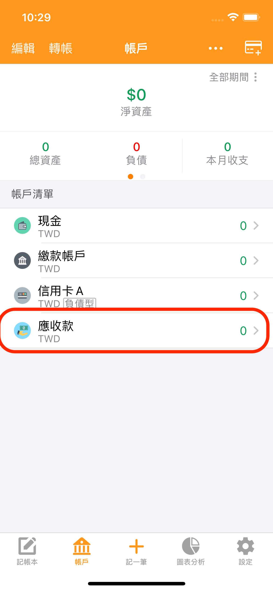
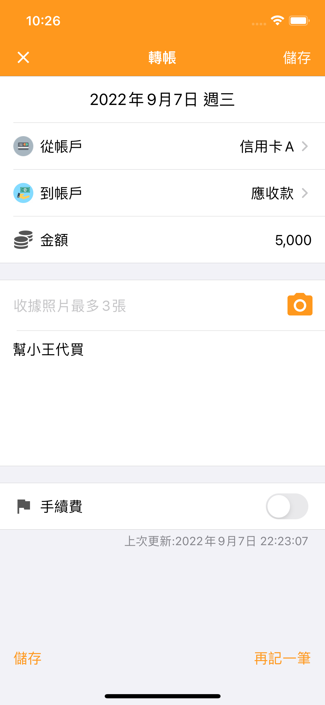
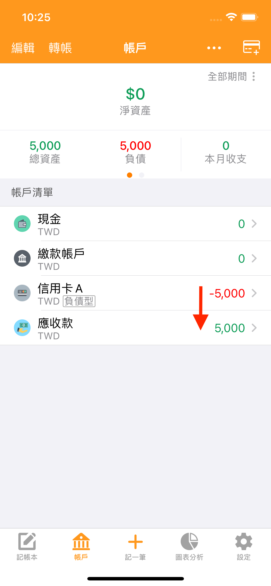
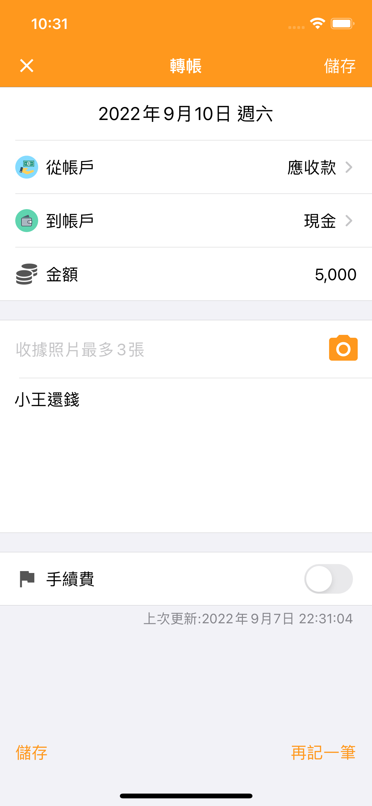
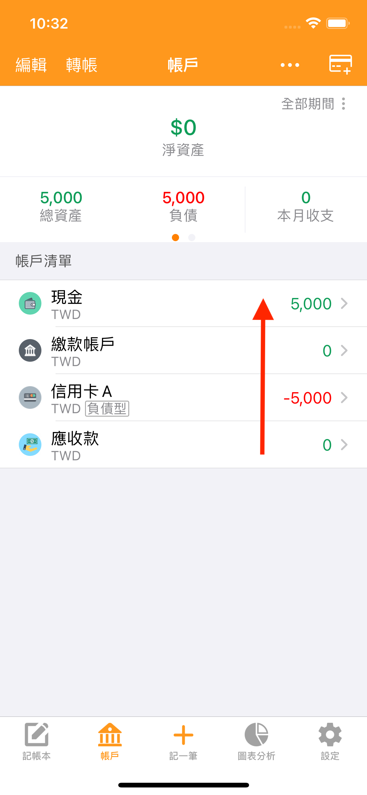

# 幫朋友代買物品怎麼記帳？

目前建議您自訂一個「借出」類型的帳戶來管理。

※之後天天記帳也會推出代買、墊付相關的專屬功能。

例如使用信用卡 A 幫朋友小王代買 5,000 元的物品，可依照下列方式記帳追蹤。

1. 新增一個【借出】類型的帳戶【應收款】&#x20;

2. 記一筆轉帳，從【信用卡 A】轉 5,000 元到【應收款】帳戶&#x20;

3. 如果對方用現金還款，請記一筆轉帳，將金額從【應收款】轉回【現金】帳戶。

