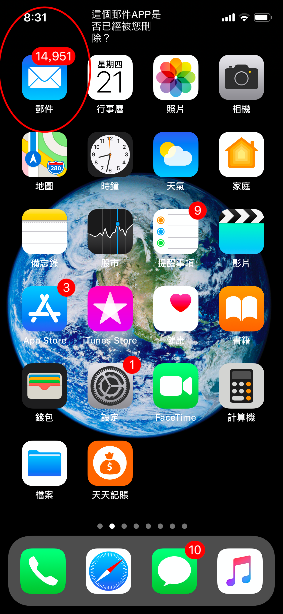

# CSV 無法匯出，怎麼辦？

#### **1. 請先確認 Apple 內建的【郵件】App 是否已被刪除**&#x20;

天天記帳的匯出郵件會透過 iOS 預設的【郵件】App 寄出。

如果已刪除【郵件】App，請先重新安裝，通常即可解決。

#### 2. 確認 iPhone 的預設郵件 App 是否為 Apple 內建的【郵件】

如果您將 Gmail 等其他 App 設為預設郵件 App，請改回【郵件】。

.png>)

#### **3. 檢查【郵件】App 的「寄件匣」是否有未寄出的電子郵件**

【郵件】App 裡若有未寄出的郵件，也可能造成 CSV 無法匯出。請開啟【郵件】App，下拉更新後寄出寄件匣中的郵件。

**4. 檢查電子郵件帳號是否設定正確**

如果【郵件】App 沒有問題，請參考下方 Apple 官方教學，檢查電子郵件設定。

將電子郵件帳號新增到 iPhone、iPad 或 iPod touch\
[https://support.apple.com/zh-tw/HT201320](https://support.apple.com/zh-tw/HT201320) 
