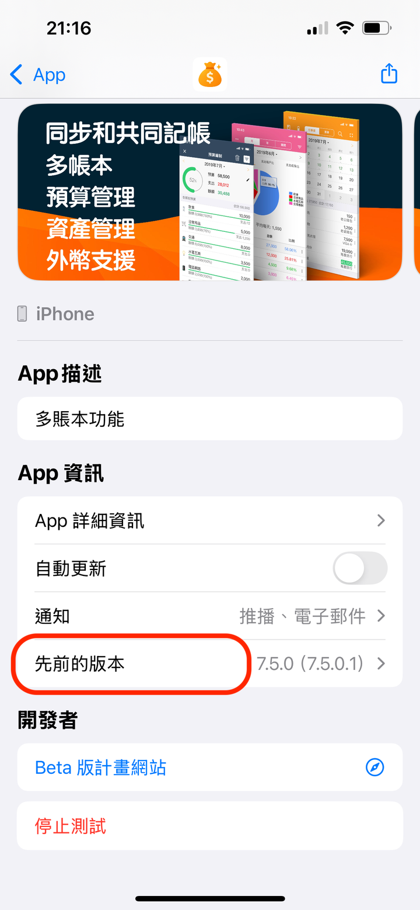
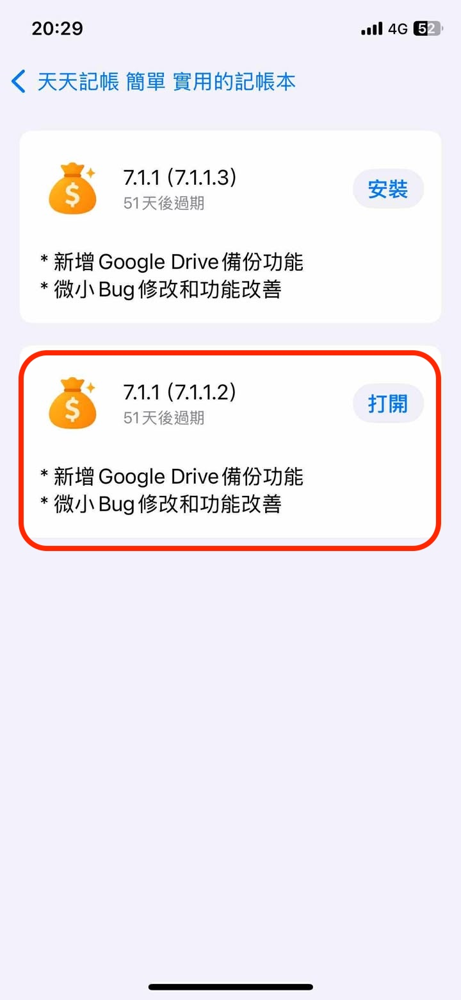

# 更新後APP無法開啟，如何解決？

請嘗試按如下操作試試

## 1.下載先前的版本Ver7.1.1.2

1.1. 點開下面的連結，按指示參加Beta測試，並下載TestFlight這個Apple提供的App\
[https://testflight.apple.com/join/2SmGmL2X](https://testflight.apple.com/join/2SmGmL2X)

1.2. 點 TestFlight裡的【先前的版本】的按鈕

&#x20;

1.3. 安裝 7.1.1.2 這個版本

&#x20;

## 2. 備份資料

如果先前版本安裝成功，請手動備份1次資料

※前往天天記帳的設定 > **Google Dirvie 資料備份轉移**

如果沒有Google帳號，請可以用「**iCloud資料備份轉移**」功能

## 3.不刪除重新安裝App

3.1.前往iPhone的「設定」> 「一般」>「 iPhone儲存空間」&#x20;

3.2.選擇天天記帳&#x20;

3.3.按 「卸載App 按鈕」&#x20;

※不同於刪除，卸載會保留記帳資料&#x20;

.PNG>)&#x20;

3.4. 重新安裝最新正式版

如果上述不能解決問題,請直接聯繫swalloworks@gmail.com
