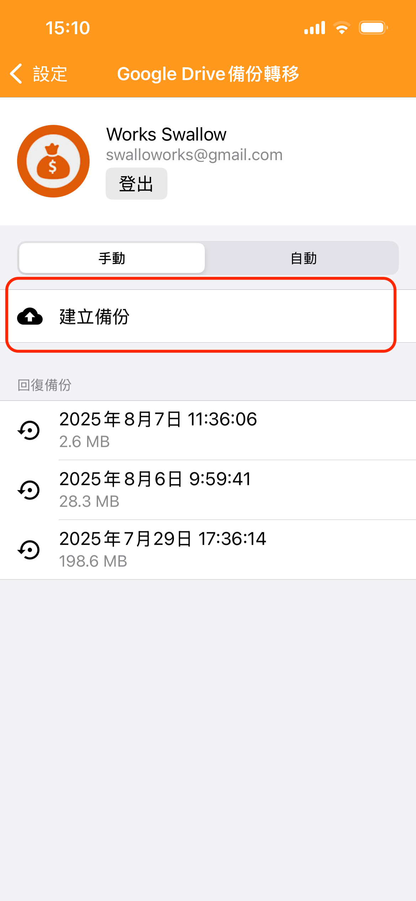
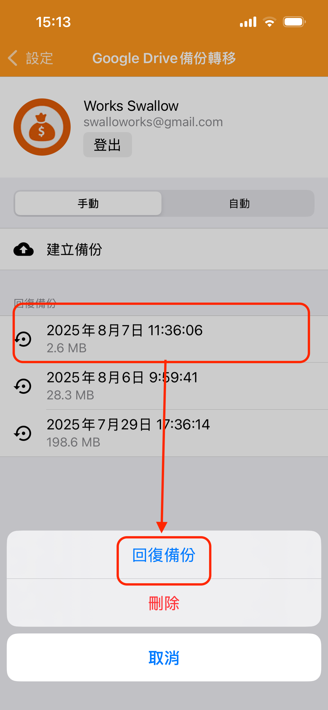

# 更新後 App 無法開啟，如何解決？

請依照下列步驟嘗試處理：

## 1. 下載測試版本 Ver. 7.6

1.1. 開啟下方連結，依照指示加入 Beta 測試，並下載 Apple 提供的 TestFlight App 

[https://testflight.apple.com/join/D2BUChQ6](https://testflight.apple.com/join/D2BUChQ6)

1.2. 開啟 TestFlight，下載測試版本 7.6

## 2. 備份資料

如果測試版本安裝成功，請使用【**Google Drive 資料備份轉移**】功能手動備份一次

※前往天天記帳的設定 > **Google Drive 資料備份轉移**

&#x20;

## 3. 刪除並重新安裝 App

## 4. 還原備份

再次前往天天記帳的設定 > **Google Drive 資料備份轉移**還原備份

&#x20;

如果以上方式仍無法解決，請直接聯絡 swalloworks@gmail.com。
