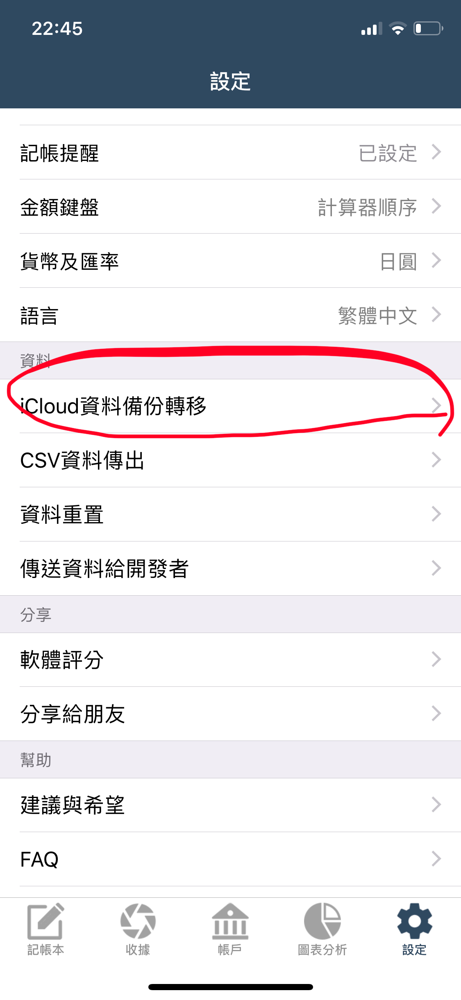

# 換手機時，如何將資料移到新手機上？

### 如果新手機是 Android，請參考


[ru-he-jiang-zi-liao-zhuan-yi-dao-android-shou-ji-shang.md](ru-he-jiang-zi-liao-zhuan-yi-dao-android-shou-ji-shang.md)


### 如果新手機也是 iOS

換手機時，可以透過以下兩種方式將天天記帳資料從舊手機轉移到新手機。 

**方法 1 - 使用天天記帳的 iCloud 資料備份轉移功能**

使用方式如下：

**1. 舊手機建立備份**

※天天記帳的設定 > iCloud 資料備份轉移 > 建立備份

※建議在 Wi-Fi 環境下操作

**2. 新手機開啟天天記帳 App，還原備份**\
.avif>) 

#### **方法 2 -** 購買 iCloud 雲帳本功能（3 美元），再將本機帳本全部改為 iCloud 雲帳本。

之後在新手機開啟天天記帳時，資料就會自動從雲端同步。\
**iCloud 雲帳本的使用方式如下：**

1. 前往帳本清單畫面
2. 將本機帳本改為 iCloud 雲帳本

更詳細的教學請參考：[https://tiantianjizhang-tw.swalloworkstudio.com/manual/cloud-book.html](https://tiantianjizhang-tw.swalloworkstudio.com/manual/cloud-book.html)\
\
如有不清楚的地方，請隨時聯絡我們。
