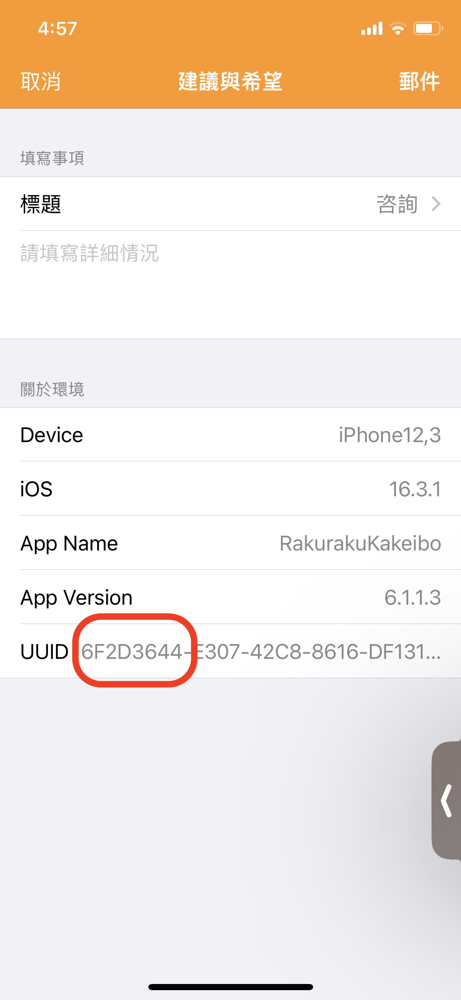
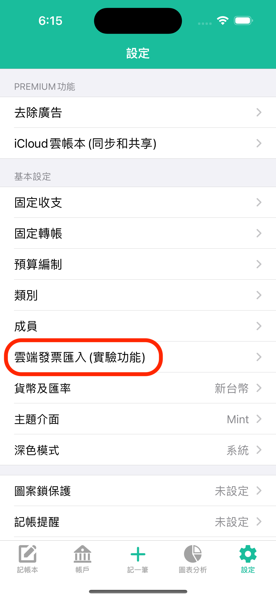
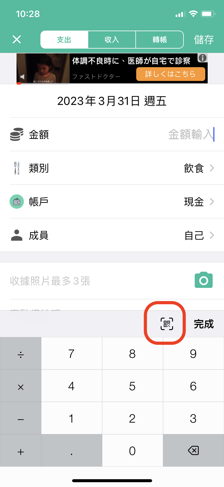

# 請問有載具雲端發票匯入功能嗎？


**Happy new year，感謝使用天天記帳。**

### <mark style="color:green;">**電子發票匯入和發票掃描功能已經恢復，麻煩更新到最新版本6.6.1。**</mark>

&#x20;**AppStore連結： https://apps.apple.com/app/id954944283**

**如有任何問題，歡迎隨時聯繫我們。 祝好， 天天記帳敬上**。


雲端發票功能目前還在公開測試中, 僅對一部分使用者開放。&#x20;

如果您的發票功能沒有開啟，請從天天記帳的設定 > 建議與希望聯繫我們。

或者把這個介面UUID欄目的前8碼直接郵至swalloworks@gmail.com

**※以下是該功能的相關螢幕截圖**

1.雲端發票匯入&#x20;

※天天記帳的設定 > 雲端發票匯入

2. 電子發票掃描

