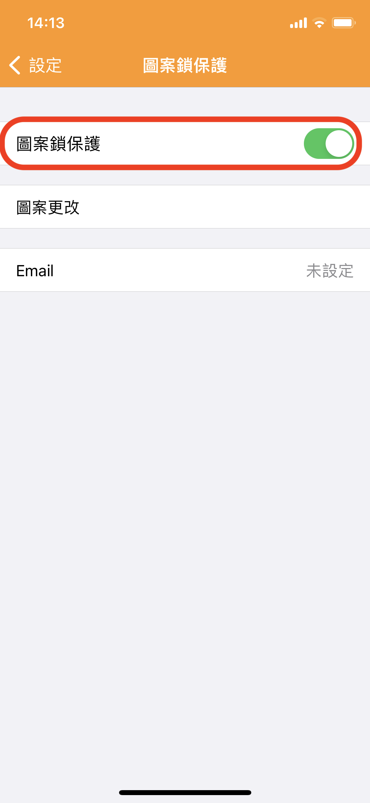
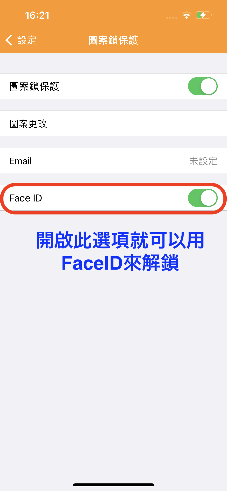

# 帳本如何設定密碼？

天天記帳目前提供圖案鎖（Pattern Lock），也可搭配 Face ID 或 Touch ID 等生物辨識解鎖。

設定方式如下：

1\. 前往天天記帳的設定 > 圖案鎖保護

2. 開啟「圖案鎖保護」選項

&#x20;

3. 設定解鎖圖案（請用手指連接三個以上的點）

&#x20;

天天記帳也能搭配 Touch ID 和 Face ID 解鎖。&#x20;

只要在圖案鎖設定頁面開啟「Face ID 解鎖」即可使用。

&#x20;

### ※如果沒有顯示 Face ID 解鎖選項，請檢查 iPhone 的 Face ID 設定

### 檢查 Face ID 設定

若要檢查 Face ID 設定，請前往「設定」>「Face ID 與密碼」。確認[已設定 Face ID](https://support.apple.com/zh-tw/HT208109)，而且您想嘗試搭配 Face ID 使用的功能已開啟。

&#x20;

&#x20;

&#x20;
