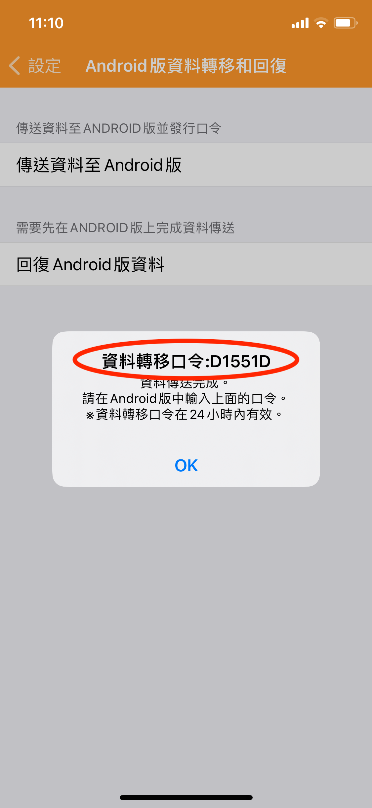

# 如何將資料轉移到 Android 手機上？

若要將資料轉移到 Android 手機，請依照下列步驟操作：

1. **iOS 版天天記帳先上傳資料**
   1. 前往設定 > Android 版資料轉移和回復
   2. 點選「傳送資料至 Android 版」
   3. 傳送完成後，會顯示一組資料轉移口令，請記下這組號碼。  &#x20;

       &#x20;
2. **Android 版天天記帳還原資料**
   1. 前往 Android 版天天記帳的「設定」>「iOS 版資料轉移和回復」
   2. 點選「回復 iOS 版資料」按鈕，輸入上述口令號碼即可。
