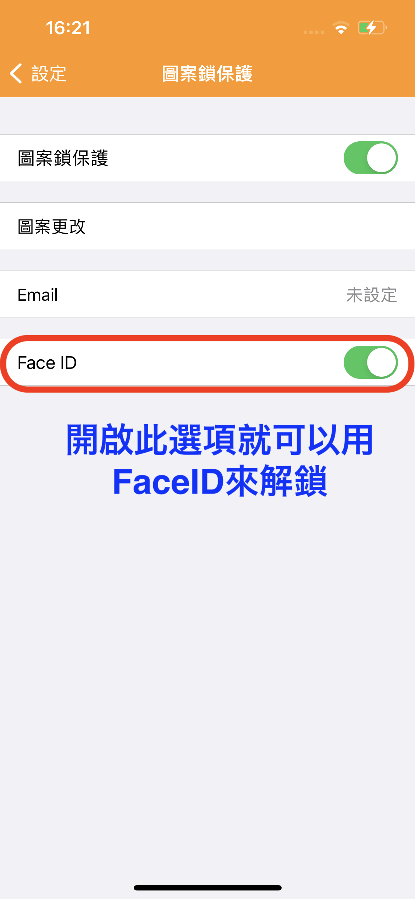
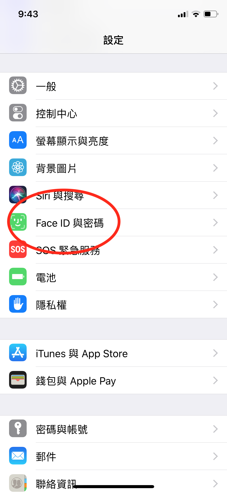
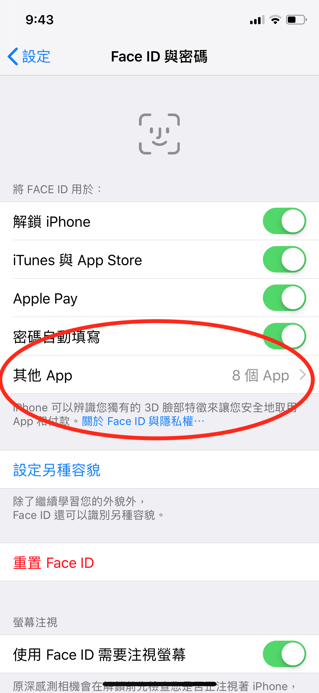
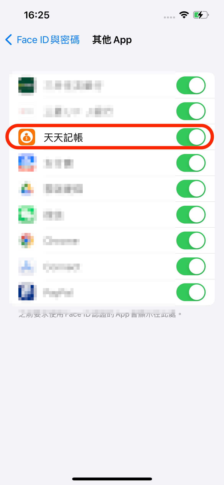

# 如何用 Face ID 等生物辨識解鎖？

天天記帳的圖案鎖可以搭配 Face ID 使用。

只要開啟 Face ID 選項，即可用 Face ID 解鎖。

### ※如果沒有顯示 Face ID 解鎖選項，請檢查 iPhone 的 Face ID 設定

### 檢查 Face ID 設定

若要檢查 Face ID 設定，請前往「設定」>「Face ID 與密碼」。確認[已設定 Face ID](https://support.apple.com/zh-tw/HT208109)，而且您想嘗試搭配 Face ID 使用的功能已開啟。

