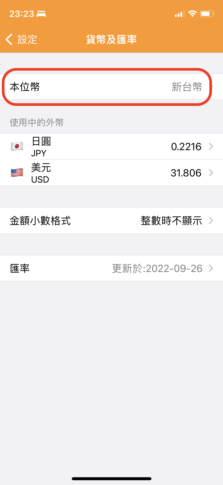
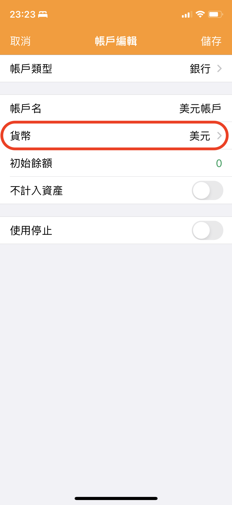
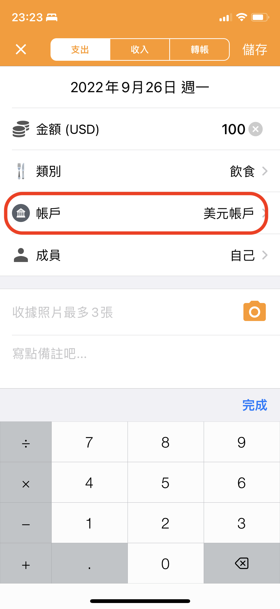
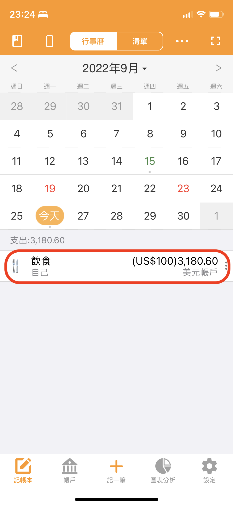

# 如何用外幣記帳？

要用外幣記帳，需要自訂新增一個管理外幣的帳戶，並正確設定本位幣。

詳細使用方法如下：



#### 1. 請先確認本位幣是否正確，並將最常用的貨幣設定為本位幣

※天天記帳的設定 > 貨幣及匯率 > 本位幣

#### 2. 新增外幣帳戶，並在貨幣欄位選擇對應的外幣

※點選帳戶 > 帳戶頁面右上角的新增帳戶按鈕

#### 3. 記錄收支時，請輸入外幣金額，並選擇外幣帳戶

