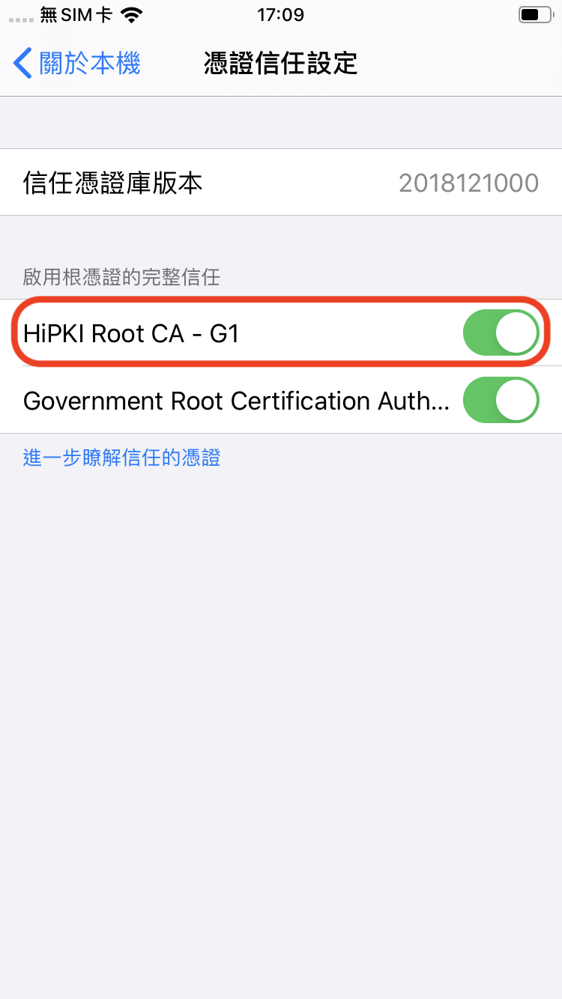

# 使用電子發票功能時跳出「伺服器憑證無效／可能遭到冒用 api.einvoice.nat.gov.tw」的警告，該怎麼辦？

**這是因為部分舊版 iOS（13–16）內建的信任清單沒有收錄&#x20;**_**HiPKI Root CA – G1**_**，而財政部電子發票平台目前正是用這條憑證鏈。請依下列步驟手動安裝並啟用該根憑證，即可恢復連線：**

1. **下載憑證**\
   用 **Safari** 開啟連結\
   `https://eca.hinet.net/download/HRCA.cer`
2. **安裝描述檔**
   * 打開 **設定 App** ▸ **已下載描述檔**\
     （若看不到，可到 **設定 ▸ 一般 ▸ VPN 與裝置管理**）。
   * 點 **〔安裝〕** ➜ 輸入解鎖密碼 ➜ 再按一次 **〔安裝〕**。
3.  **啟用完整信任**

    * 回到 **設定 ▸ 一般 ▸ 關於本機 ▸ 憑證信任設定**。
    * 找到 **「HiPKI Root CA – G1」**，開啟右側選項。
    * 

4. **重新啟動 App**\
   關閉並重開本 App，再次使用電子發票功能，應不再出現憑證錯誤。

> **安全提醒**
>
> * _HiPKI Root CA – G1_ 為中華電信官方政府根憑證，只影響政府／公部門網站的 TLS 連線，不會降低其他網站的安全性。
> * 若日後不需使用，可至 **設定 ▸ 一般 ▸ VPN 與裝置管理** 移除描述檔，系統會自動取消信任。
