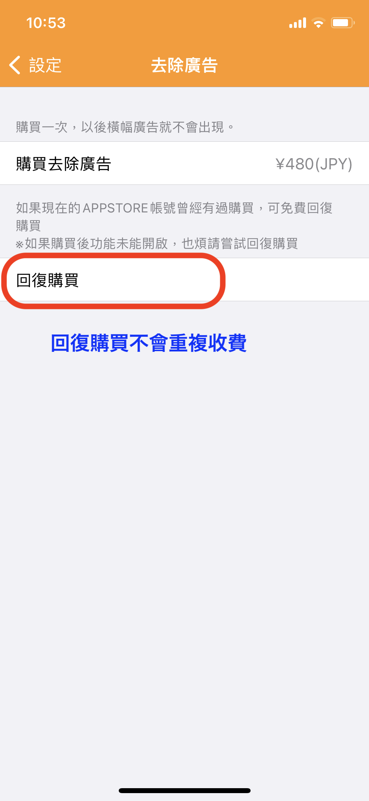
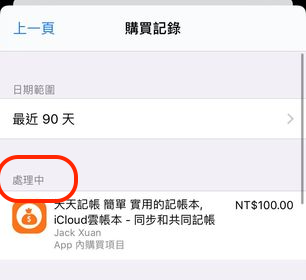
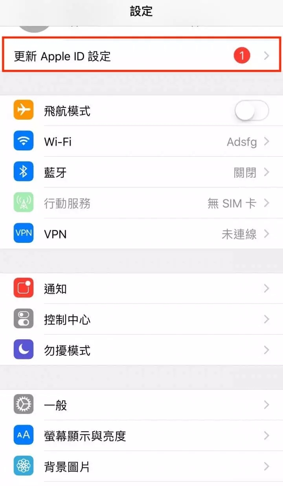

# 為什麼購買去除廣告後，仍然有廣告？

感謝您的購買。這可能是信用卡付款尚未即時入帳造成的。

### **1. 請先使用「回復購買」功能，再執行一次去除廣告處理。**&#x20;

**※天天記帳的設定 > 去除廣告 > 回復購買**

※「回復購買」不會重複收費。

&#x20;

### 2. 如果「回復購買」無法解決，請確認訂單是否顯示【處理中】&#x20;

請查看購買紀錄中是否顯示【處理中】。&#x20;

如果顯示【處理中】，代表尚未入帳，請等入帳後再執行「回復購買」。

&#x20;

### 3. 如果已不是【處理中】，請確認是否需要更新 Apple ID 設定或重新驗證

#### 更新 Apple ID 設定

1. 請先前往手機的【設定】App，確認是否出現【更新 Apple ID 設定】提示

2. 如果有，請點選「更新 Apple ID 設定」，並依照後續步驟重新輸入及驗證 Apple ID 密碼。

### 4. 如果以上方式仍無法解決，請登出 App Store 一次，重新登入後再試試「回復購買」

登出操作如下：

1. 開啟 App Store App
2. 點選右上角的帳號圖示
3. 向下滑到畫面底部，應會看到【登出】按鈕
4. 登出一次
5. 重新登入

