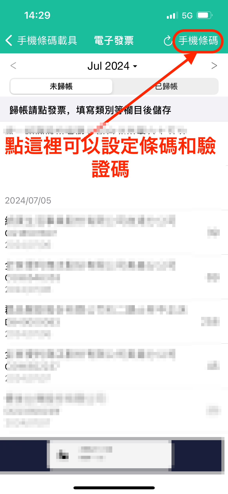

# 為什麼之前可以匯入雲端發票，現在就不行了？

可能是因為驗證碼字元組合不符合新要求，需要重新設定。

※驗證碼字元組合需從英文大寫、英文小寫、數字及特殊符號 4 類中，至少選擇 3 類組成。&#x20;

請變更驗證碼後再試一次。&#x20;

詳細步驟如下：

1. 前往財政部網站變更驗證碼
2. 變更天天記帳的驗證碼&#x20;
   1. 前往天天記帳的設定 > 雲端發票匯入&#x20;
   2. 點選右上角【手機條碼】按鈕
   3. 輸入新的驗證碼，點選「儲存」按鈕

       

如果以上方式仍無法解決，請直接聯絡 swalloworks@gmail.com。
