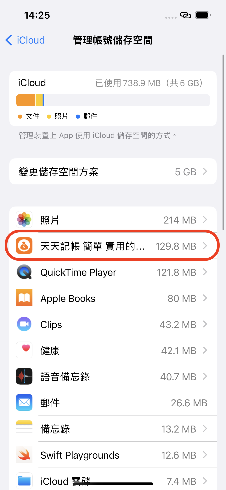

# 為什麼新手機看不到舊手機的備份檔？

#### 1. 請先確認舊手機的備份是否已上傳到 iCloud。

確認方式如下：

前往 iPhone 的「設定」> \[您的名稱] >「iCloud」>「管理帳號儲存空間」，確認是否有天天記帳的備份檔案。

&#x20;

#### **2. 如果雲端還沒有備份檔，請檢查舊手機的 iCloud 設定；必要時可登出 Apple ID 一次後，再重新備份**

2.1 請依照下方連結正確設定 iCloud



2.2 如果 iCloud 設定沒問題，請登出 Apple ID 一次


[ru-he-deng-chu-appleid.md](ru-he-deng-chu-appleid.md)


#### **3. 如果雲端已有備份檔案，請檢查新手機的 iCloud 設定；必要時可登出 Apple ID 一次**

#### &#x20;

 
