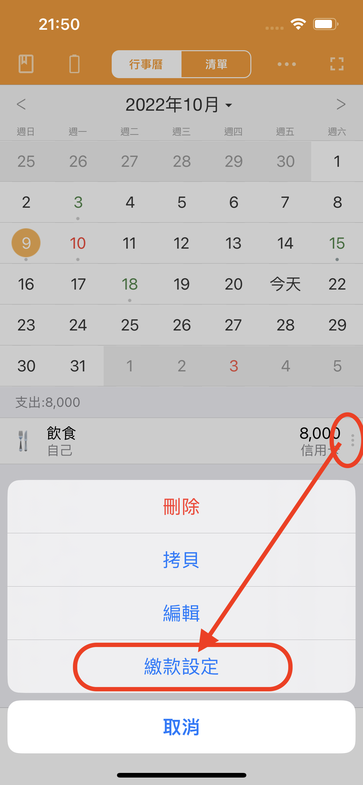
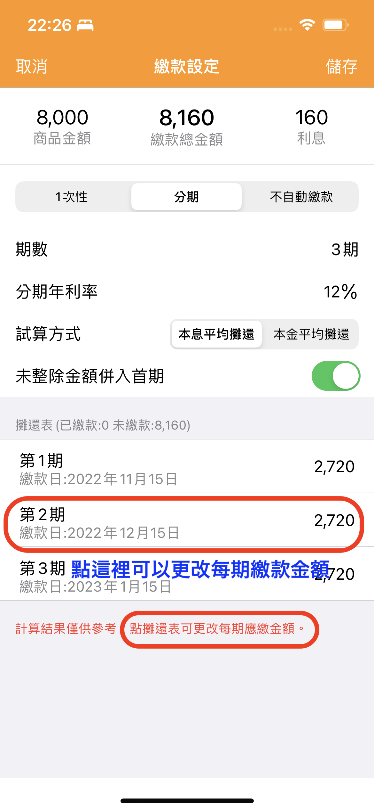

# 信用卡分期如何設定？

天天記帳目前支援針對單筆信用卡消費設定分期。&#x20;


**前提：**

設定信用卡分期需符合以下 2 個前提：&#x20;

1. 該信用卡帳戶需要先設定繳款帳戶、結帳日和繳款日。

2. 相關信用卡支出的繳款日必須是未來日期。如果繳款日已是過去日期，就無法追加設定分期。



具體操作如下：

#### 1. 在行事曆或清單畫面，點選要分期的支出紀錄右側按鈕，然後選擇【繳款設定】

#### 2. 繳款設定畫面有試算功能，可在試算結果的基礎上調整每期繳款金額。

#### 3. 設定完成後，點選右上角【儲存】按鈕。

