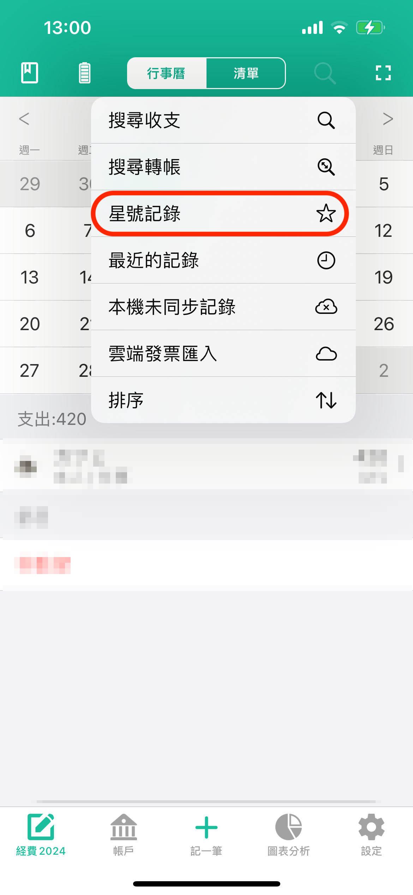

# 星號記錄功能如何使用？

星號記錄功能主要用於管理常用的收支記錄。&#x20;

您可以把常用的收支記錄設定為星號記錄，以便日後查看和複製使用。

詳細使用方法如下：

1.  在行事曆或者清單介面，為常用消費標註星號

    
2.  查看時，點行事曆介面右上第二個按鈕，然後選擇“星號記錄”

    
3.  複製時，點星號記錄清單中右側的拷貝按鈕，就可以把常用消費拷貝到記帳介面

    
